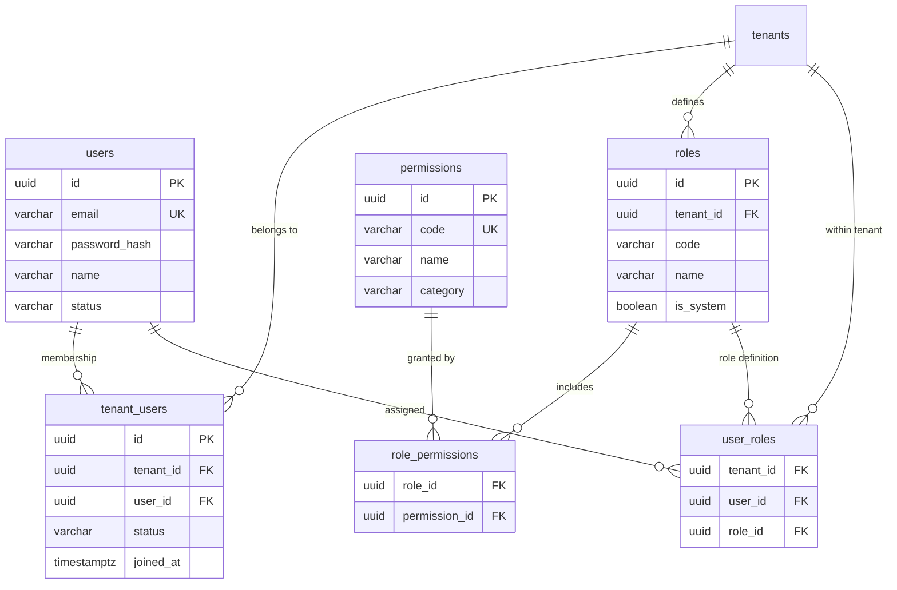

# Identity & Access Management (IAM) and RBAC

This document details the architecture, data models, authentication mechanisms, and REST API for the **Identity & Access Management (IAM)** and **Role-Based Access Control (RBAC)** engine in Mergiate Core.

---

## 1. Architectural Model: Global Identity + Tenant Membership

Mergiate Core adopts a modern multi-tenant identity model similar to platforms like Slack, GitHub, and Linear:
1. **Global Identity (`users`)**:
   - A user registers once with a globally unique email and salted bcrypt password hash.
   - Credentials belong to the person/account, not an individual tenant.
2. **Tenant Membership (`tenant_users`)**:
   - Users belong to one or more tenants via a membership relationship (`tenant_users`).
   - A user can be an active member of Company A and Company B simultaneously.
3. **Tenant-Scoped RBAC (`roles` & `user_roles`)**:
   - Roles are defined within a specific tenant (e.g. Tenant A might define `Finance Manager`, while Tenant B defines `Store Supervisor`).
   - Role assignments and resulting permissions are evaluated strictly within the context of the active tenant.
4. **Stateless JWT Authorization**:
   - When a user logs in and selects a tenant, a cryptographically signed HMAC-SHA256 JWT is issued.
   - The token contains claims: `uid` (User UUID), `tid` (Tenant UUID), `roles` ([]string), and resolved `perms` ([]string).
   - Downstream requests validate the token statelessly without constant database round-trips for permission lookups.

---

## 2. Database Schema



### Pre-Seeded System Permissions Catalog

> **Updated**: ERP Dogfood Refactor (Sep 2026) — added `organization`, `tenant`, `attachment`, `sequence`, `custom-field`, `communication` categories.

| Permission Code | Category | Description |
|---|---|---|
| `iam:manage` | `iam` | Manage users, members, and roles |
| `document:create` | `document` | Create new business documents |
| `document:read` | `document` | Read and view documents |
| `document:update` | `document` | Modify draft documents |
| `document:transition`| `document` | Transition workflow lifecycle status |
| `document:delete` | `document` | Cancel or delete documents |
| `party:create` | `party` | Create customers, vendors, and partners |
| `party:read` | `party` | View party directory |
| `party:update` | `party` | Edit party profiles |
| `party:delete` | `party` | Deactivate parties |
| `product:create` | `product` | Create products and units |
| `product:read` | `product` | Browse catalog products |
| `product:update` | `product` | Update products and pricing |
| `audit:read` | `audit` | Inspect immutable audit log trail |
| `organization:create` | `organization` | Create organizations |
| `organization:read` | `organization` | View organizations |
| `organization:update` | `organization` | Edit organization profiles |
| `organization:delete` | `organization` | Remove organizations |
| `tenant:manage` | `tenant` | Manage tenant settings and configuration |
| `attachment:upload` | `attachment` | Upload file attachments |
| `attachment:read` | `attachment` | View and download attachments |
| `attachment:delete` | `attachment` | Delete attachments |
| `sequence:manage` | `sequence` | Configure document number sequences |
| `custom-field:manage` | `custom-field` | Define and manage custom field schemas |
| `communication:create` | `communication` | Create comments and notifications |
| `communication:read` | `communication` | Read comments and notification history |

### Permission Matrix by Role

| Permission | `super-admin` (`*`) | `admin` | `manager` | `staff` | `viewer` |
|---|:---:|:---:|:---:|:---:|:---:|
| `iam:manage` | ✅ | ✅ | — | — | — |
| `document:*` | ✅ | ✅ | ✅ | create/read/update | read |
| `party:*` | ✅ | ✅ | ✅ | create/read | read |
| `product:*` | ✅ | ✅ | ✅ | read | read |
| `organization:*` | ✅ | ✅ | read | read | — |
| `tenant:manage` | ✅ | ✅ | — | — | — |
| `audit:read` | ✅ | ✅ | ✅ | — | — |
| `attachment:*` | ✅ | ✅ | ✅ | upload/read | read |
| `communication:*` | ✅ | ✅ | ✅ | ✅ | read |

---

## 3. Authentication & Authorization Middleware

> **Updated**: ERP Dogfood Refactor (Sep 2026) — AuthRequired is now applied globally; no endpoint is unauthenticated by default.

### `middleware.AuthRequired(tokenManager)`
- Extracts `Bearer <token>` from the `Authorization` header.
- Validates HMAC signature and token expiration.
- **Production enforcement**: Server panics at startup if `JWT_SECRET` is not set or is the default development placeholder.
- Injects `sdk.AuthClaims` and `sdk.TenantID` into request `context.Context`.
- If missing or invalid, returns `HTTP 401 Unauthorized`.
- **Applied globally** on all `/api/v1/...` routes. There are no unauthenticated business endpoints.

### `middleware.RequirePermission(code)`
- Checks whether the user's active token claims contains the specified permission code.
- Supports wildcard `*` permissions (super-admin bypass).
- If absent, returns `HTTP 403 Forbidden`.
- Applied per-handler for fine-grained resource access control.

### `middleware.TenantRequired()`
- Validates the `X-Tenant-ID` header is present and parses as a valid UUID.
- **Cross-tenant isolation**: If the JWT's `tid` claim does not match the `X-Tenant-ID` header, returns `HTTP 403 TENANT_MISMATCH`. This prevents horizontal privilege escalation across tenants.
- Injects the validated tenant ID into `context.Context` for downstream use.

### CORS Policy
- Allowed origins are configured via `config.CORSAllowedOrigins` (no wildcard when `credentials: true`).
- Credentials mode (`withCredentials`) requires an explicit allowlist — using `*` with credentials is rejected by browsers and is enforced by the CORS middleware.

---

## 4. REST API Reference

### Authentication

#### Register Global User
```http
POST /api/v1/auth/register
Content-Type: application/json

{
  "email": "user@example.com",
  "password": "StrongPassword123!",
  "name": "Jane Doe",
  "tenant_id": "<OPTIONAL_TENANT_UUID>"
}
```

#### Login
```http
POST /api/v1/auth/login
Content-Type: application/json

{
  "email": "user@example.com",
  "password": "StrongPassword123!",
  "tenant_id": "<OPTIONAL_TENANT_UUID>"
}
```
- **Single Tenant or Tenant Provided**: Returns JWT access token and active permissions.
- **Multiple Accessible Tenants (Tenant omitted)**: Returns available tenant memberships (`requires_tenant_selection: true`).

#### Current User Profile
```http
GET /api/v1/auth/me
Authorization: Bearer <TOKEN>
```

#### Switch Active Tenant Context
```http
POST /api/v1/auth/switch-tenant
Authorization: Bearer <TOKEN>
Content-Type: application/json

{
  "tenant_id": "<TARGET_TENANT_UUID>"
}
```

---

### IAM & Role Management (Requires `iam:manage`)

#### List Permissions Catalog
```http
GET /api/v1/iam/permissions
Authorization: Bearer <TOKEN>
```

#### Member Management
- `GET /api/v1/iam/members` - List tenant members with assigned roles
- `POST /api/v1/iam/members` - Add existing global user to tenant with roles
- `POST /api/v1/iam/members/{userId}/roles` - Assign roles to member
- `DELETE /api/v1/iam/members/{userId}/roles/{roleId}` - Remove role from member

#### Role Management
- `GET /api/v1/iam/roles` - List roles defined in current tenant
- `POST /api/v1/iam/roles` - Create new role with permission IDs
- `GET /api/v1/iam/roles/{id}` - Get role details and permissions
- `POST /api/v1/iam/roles/{id}/permissions` - Replace/assign permissions to role
