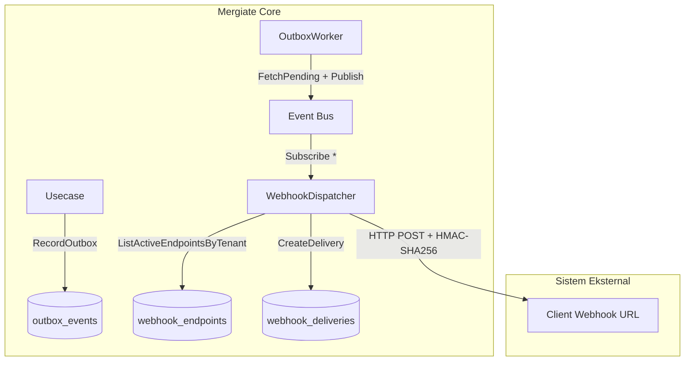

# Webhook Engine

Dokumentasi fitur **Webhook Outbox Dispatcher** di platform **Mergiate Core**.

---

## 1. Overview

Webhook memungkinkan sistem eksternal (CRM, Finance, e-commerce connector, dsb) menerima notifikasi real-time setiap kali terjadi domain event di Mergiate Core — misalnya dokumen dibuat, status berubah, atau record baru ditambahkan.

```
Mergiate Core                       Sistem Eksternal
─────────────────────────────────   ──────────────────
Domain Event terjadi                POST /your-webhook-url
  → disimpan ke outbox          →   {event_type, payload, signature}
  → OutboxWorker publish ke bus
  → WebhookDispatcher fan-out   →   Verifikasi HMAC-SHA256
  → log ke webhook_deliveries       Proses event
```

---

## 2. Arsitektur



**Alur**:
1. Usecase menulis ke outbox (atomik dalam transaksi DB).
2. `OutboxWorker` membaca outbox, mempublish ke in-memory event bus.
3. `WebhookDispatcher` (subscriber `"*"`) menerima setiap event.
4. Dispatcher mengambil semua active endpoint untuk tenant event tersebut.
5. HTTP POST dikirimkan ke setiap endpoint URL, dengan HMAC-SHA256 signature.
6. Setiap attempt dicatat ke `webhook_deliveries`.

---

## 3. Database Schema

### `webhook_endpoints`

| Kolom | Tipe | Deskripsi |
|---|---|---|
| `id` | UUID (PK) | UUIDv7 |
| `tenant_id` | UUID (FK) | Tenant pemilik endpoint |
| `name` | TEXT | Label endpoint (e.g. "CRM Production") |
| `url` | TEXT | Target URL (http/https) |
| `secret` | TEXT | Secret untuk HMAC signing (tidak pernah dikembalikan via API) |
| `is_active` | BOOLEAN | Endpoint aktif atau tidak |
| `created_at` | TIMESTAMPTZ | |
| `updated_at` | TIMESTAMPTZ | |

### `webhook_deliveries`

| Kolom | Tipe | Deskripsi |
|---|---|---|
| `id` | UUID (PK) | Delivery attempt ID |
| `endpoint_id` | UUID (FK) | Endpoint yang dituju |
| `outbox_event_id` | UUID | ID event dari outbox (soft ref) |
| `event_type` | TEXT | Type event (e.g. `document.created`) |
| `attempt` | INT | Nomor percobaan (1–3) |
| `status` | TEXT | `pending` / `success` / `failed` |
| `response_code` | INT | HTTP status code dari target |
| `response_body` | TEXT | 4KB pertama dari response body |
| `error_message` | TEXT | Pesan error jika gagal |
| `delivered_at` | TIMESTAMPTZ | Waktu sukses |
| `created_at` | TIMESTAMPTZ | Waktu percobaan |

---

## 4. REST API

Semua endpoint memerlukan autentikasi (JWT atau API Key) dan permission `webhook:manage` atau `webhook:view`.

### Register Endpoint

```http
POST /api/v1/webhooks
Authorization: Bearer <token>
X-Tenant-ID: <tenant-id>
Content-Type: application/json

{
  "name": "CRM Production",
  "url": "https://crm.example.com/mergiate/events",
  "secret": "your-webhook-secret-min-16-chars"
}
```

> **Penting**: Simpan `secret` di sisi Anda saat registrasi. Secret **tidak pernah dikembalikan lagi** oleh API (hanya hash yang disimpan di server).

**Response `201`**:
```json
{
  "data": {
    "id": "019xxxx-...",
    "tenant_id": "...",
    "name": "CRM Production",
    "url": "https://crm.example.com/mergiate/events",
    "is_active": true,
    "created_at": "2026-09-17T02:20:00Z",
    "updated_at": "2026-09-17T02:20:00Z"
  }
}
```

### List Endpoints

```http
GET /api/v1/webhooks
```

### Disable / Enable Endpoint

```http
POST /api/v1/webhooks/{id}/disable
POST /api/v1/webhooks/{id}/enable
```

### Delete Endpoint

```http
DELETE /api/v1/webhooks/{id}
```

### Lihat Delivery Logs

```http
GET /api/v1/webhooks/{id}/deliveries?limit=50
```

**Diperlukan permission**: `webhook:view` atau `webhook:manage`.

---

## 5. Payload Format

Setiap HTTP POST ke registered URL mengirimkan JSON berikut:

```json
{
  "id": "019xxxx-...",
  "tenant_id": "019yyyy-...",
  "event_type": "document.created",
  "aggregate_type": "document",
  "aggregate_id": "019zzzz-...",
  "payload": {
    "document_number": "INV-2026-0001",
    "status": "draft",
    ...
  },
  "occurred_at": "2026-09-17T02:20:00.123456Z"
}
```

---

## 6. Verifikasi Signature (HMAC-SHA256)

Setiap delivery menyertakan header:

```http
X-Mergiate-Signature: sha256=<hex-encoded-HMAC-SHA256>
X-Mergiate-Delivery: <delivery-uuid>
X-Mergiate-Event: <outbox-event-uuid>
Content-Type: application/json
```

Cara verifikasi di sisi receiver (contoh Go):

```go
import (
    "crypto/hmac"
    "crypto/sha256"
    "encoding/hex"
)

func verifySignature(secret string, body []byte, signatureHeader string) bool {
    mac := hmac.New(sha256.New, []byte(secret))
    mac.Write(body)
    expected := "sha256=" + hex.EncodeToString(mac.Sum(nil))
    return hmac.Equal([]byte(expected), []byte(signatureHeader))
}
```

Contoh verifikasi di PHP (Laravel):

```php
$secret = config('services.mergiate.webhook_secret');
$signature = $request->header('X-Mergiate-Signature');
$expected = 'sha256=' . hash_hmac('sha256', $request->getContent(), $secret);

if (!hash_equals($expected, $signature)) {
    abort(401, 'Invalid webhook signature');
}
```

> **Selalu gunakan `hash_equals` / `hmac.Equal`** (constant-time comparison) untuk mencegah timing attack.

---

## 7. Retry Policy

Jika delivery gagal (non-2xx response atau timeout), dispatcher akan retry otomatis:

| Percobaan | Delay sebelum retry | Max timeout per attempt |
|---|---|---|
| 1 (initial) | — | 10 detik |
| 2 | 1 detik | 10 detik |
| 3 | 5 detik | 10 detik |

Setelah 3 kali gagal, delivery dianggap `failed` dan tidak ada retry lagi. Semua attempts tercatat di `webhook_deliveries` untuk audit.

> Untuk replay manual, implementasi ulang masih perlu ditambahkan (roadmap).

---

## 8. Permissions RBAC

| Permission | Aksi yang diizinkan |
|---|---|
| `webhook:manage` | Register, disable, enable, delete endpoint |
| `webhook:view` | List endpoints, lihat delivery logs |

Kedua permission dapat di-assign ke Role atau Service Account via IAM Core.

---

## 9. Catatan Keamanan

- **Secret minimum 16 karakter** — API menolak secret yang terlalu pendek.
- **Secret tidak pernah dikembalikan via API** — hanya ditampilkan saat registrasi awal.
- **URL harus `http://` atau `https://`** — URL lain (file://, ftp://, dsb) ditolak.
- **Response body di-truncate 4KB** — untuk mencegah memory exhaustion dari receiver yang mengembalikan payload besar.
- **Timeout 10 detik per attempt** — receiver yang lambat tidak akan mem-block dispatcher.

---

## 10. Roadmap

| Fitur | Status |
|---|---|
| Register/list/delete webhook endpoint | ✅ Done |
| HTTP POST delivery dengan HMAC signing | ✅ Done |
| Retry 3x dengan backoff | ✅ Done |
| Delivery log audit trail | ✅ Done |
| Event type filtering per endpoint | 🔲 Planned |
| Manual replay delivery | 🔲 Planned |
| Webhook dashboard UI | 🔲 Planned |
| Dead letter queue (DLQ) setelah max retry | 🔲 Planned |
