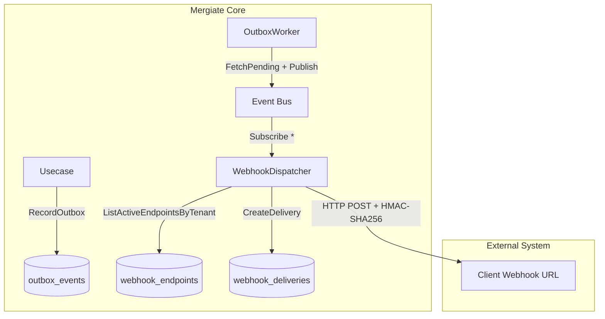

# Webhook Engine

Documentation for the **Webhook Outbox Dispatcher** in **Mergiate Core**.

---

## 1. Overview

Webhooks allow external systems (CRM, Accounting, e-commerce connectors, etc.) to receive real-time notifications whenever domain events occur in Mergiate Core — such as document creation, status updates, or record additions.

```
Mergiate Core                       External System
─────────────────────────────────   ──────────────────
Domain Event occurs                 POST /your-webhook-url
  → Stored to transactional outbox  →   {event_type, payload, signature}
  → OutboxWorker publishes to bus
  → WebhookDispatcher fans out      →   Verify HMAC-SHA256 signature
  → Logs to webhook_deliveries          Process event
```

---

## 2. Architecture



**Workflow**:
1. Usecase records events to the outbox table within the same database transaction.
2. `OutboxWorker` asynchronously polls pending events and publishes them to the in-memory event bus.
3. `WebhookDispatcher` (a wildcard subscriber `"*"`) receives each dispatched event.
4. The dispatcher looks up all active webhook endpoints configured for that specific tenant.
5. An HTTP POST request is sent to each endpoint URL, signed with an HMAC-SHA256 signature header.
6. Every attempt is logged in `webhook_deliveries` for monitoring and auditing.

---

## 3. Database Schema

### `webhook_endpoints`

| Column | Type | Description |
|---|---|---|
| `id` | UUID (PK) | UUIDv7 primary key |
| `tenant_id` | UUID (FK) | Owning tenant ID |
| `name` | TEXT | Endpoint label (e.g. "CRM Production") |
| `url` | TEXT | Target URL (http/https) |
| `secret` | TEXT | Secret used for HMAC signing (never returned via API) |
| `is_active` | BOOLEAN | Whether endpoint is active |
| `created_at` | TIMESTAMPTZ | Creation timestamp |
| `updated_at` | TIMESTAMPTZ | Last modification timestamp |

### `webhook_deliveries`

| Column | Type | Description |
|---|---|---|
| `id` | UUID (PK) | Delivery attempt identifier |
| `endpoint_id` | UUID (FK) | Target endpoint ID |
| `outbox_event_id` | UUID | Outbox event identifier |
| `event_type` | TEXT | Type of event (e.g. `document.created`) |
| `attempt` | INT | Attempt number (1–3) |
| `status` | TEXT | `pending` / `success` / `failed` |
| `response_code` | INT | Target HTTP response code |
| `response_body` | TEXT | First 4KB of target response body |
| `error_message` | TEXT | Error message if delivery failed |
| `delivered_at` | TIMESTAMPTZ | Successful delivery timestamp |
| `created_at` | TIMESTAMPTZ | Attempt recorded timestamp |

---

## 4. REST API

All webhook endpoints require authentication (JWT Bearer or M2M API Key) and corresponding permissions (`webhook:manage` or `webhook:view`).

### Register Endpoint

```http
POST /api/v1/webhooks
Authorization: Bearer <token>
X-Tenant-ID: <tenant-id>
Content-Type: application/json

{
  "name": "CRM Production",
  "url": "https://crm.example.com/mergiate/events",
  "secret": "your-webhook-secret-min-16-chars"
}
```

> **Important**: Save your `secret` securely upon registration. The secret is hashed and **never returned again** by the API.

**Response `201`**:
```json
{
  "data": {
    "id": "019xxxx-...",
    "tenant_id": "...",
    "name": "CRM Production",
    "url": "https://crm.example.com/mergiate/events",
    "is_active": true,
    "created_at": "2026-09-17T02:20:00Z",
    "updated_at": "2026-09-17T02:20:00Z"
  }
}
```

### List Endpoints

```http
GET /api/v1/webhooks
```

### Disable / Enable Endpoint

```http
POST /api/v1/webhooks/{id}/disable
POST /api/v1/webhooks/{id}/enable
```

### Delete Endpoint

```http
DELETE /api/v1/webhooks/{id}
```

### View Delivery Logs

```http
GET /api/v1/webhooks/{id}/deliveries?limit=50
```

---

## 5. Payload Format

Every HTTP POST payload sent to the registered endpoint contains standard event metadata:

```json
{
  "id": "019xxxx-...",
  "tenant_id": "019yyyy-...",
  "event_type": "document.created",
  "aggregate_type": "document",
  "aggregate_id": "019zzzz-...",
  "payload": {
    "document_number": "INV-2026-0001",
    "status": "draft"
  },
  "occurred_at": "2026-09-17T02:20:00.123456Z"
}
```

---

## 6. Signature Verification (HMAC-SHA256)

Every webhook request includes verification headers:

```http
X-Mergiate-Signature: sha256=<hex-encoded-HMAC-SHA256>
X-Mergiate-Delivery: <delivery-uuid>
X-Mergiate-Event: <outbox-event-uuid>
Content-Type: application/json
```

### Go Verification Example

```go
import (
    "crypto/hmac"
    "crypto/sha256"
    "encoding/hex"
)

func verifySignature(secret string, body []byte, signatureHeader string) bool {
    mac := hmac.New(sha256.New, []byte(secret))
    mac.Write(body)
    expected := "sha256=" + hex.EncodeToString(mac.Sum(nil))
    return hmac.Equal([]byte(expected), []byte(signatureHeader))
}
```

### PHP / Laravel Verification Example

```php
$secret = config('services.mergiate.webhook_secret');
$signature = $request->header('X-Mergiate-Signature');
$expected = 'sha256=' . hash_hmac('sha256', $request->getContent(), $secret);

if (!hash_equals($expected, $signature)) {
    abort(401, 'Invalid webhook signature');
}
```

> **Security Note**: Always use constant-time string comparison functions (`hmac.Equal`, `hash_equals`) to protect against timing attacks.

---

## 7. Retry Policy

If delivery fails (non-2xx HTTP status or connection timeout), the dispatcher automatically retries:

| Attempt | Delay before retry | Timeout per attempt |
|---|---|---|
| 1 (Initial) | Immediate | 10 seconds |
| 2 | 1 second | 10 seconds |
| 3 | 5 seconds | 10 seconds |

After 3 failed attempts, delivery is marked as `failed` and logged to `webhook_deliveries` for auditing.

---

## 8. RBAC Permissions

| Permission | Description |
|---|---|
| `webhook:manage` | Register, enable, disable, and delete endpoints |
| `webhook:view` | List endpoints and inspect delivery logs |

Both permissions can be assigned to Roles or Service Accounts via IAM.

---

## 9. Security Best Practices

- **Minimum Secret Length**: At least 16 characters required during registration.
- **Write-only Secret**: Secrets are hashed and never exposed after creation.
- **URL Validation**: Only valid `http://` and `https://` URLs are accepted.
- **Payload Safety**: Target response bodies are capped at 4KB to prevent memory exhaustion.
- **Strict Timeouts**: 10-second per-attempt timeout ensures slow endpoints never block the dispatcher queue.
